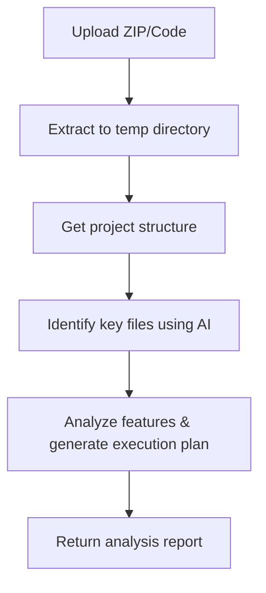
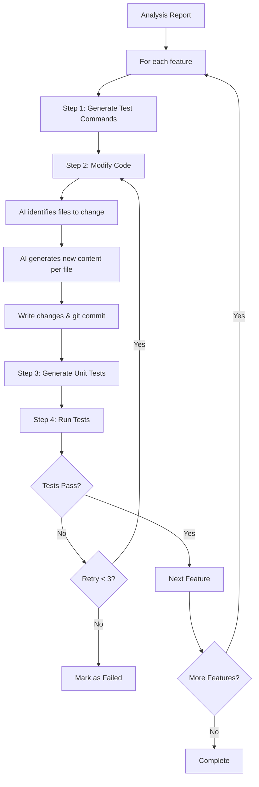

# Code Agent - AI-Powered Code Analysis & Testing

[English](README.md) | [简体中文](README.zh-CN.md)

An intelligent code analysis and testing agent powered by Google's Gemini AI. This tool analyzes codebases, implements features, generates unit tests, and validates changes automatically.

> **⚠️ IMPORTANT NOTICE**  
> **Network access to Google Gemini API is required** for this application to function. Ensure your environment has:
> - Active internet connection
> - Access to Google AI services
> - Valid Gemini API key configured
> - No firewall blocking Google API endpoints

## 🌟 Features

- **📊 Intelligent Code Analysis**: Analyzes project structure and identifies key files
- **🔧 Automated Code Modification**: Implements features using AI with a two-step process
- **🧪 Smart Test Generation**: Automatically generates unit tests based on code changes
- **✅ Test Framework Recommendation**: Suggests the best testing framework for your project
- **🔄 Automated Testing**: Runs tests with dependency installation and reports results
- **🐳 Docker Support**: Fully containerized with pre-configured environment
- **🌐 Web Interface**: User-friendly UI for code analysis and testing workflows

## 📋 Table of Contents

- [Architecture](#architecture)
- [Logic Flow](#logic-flow)
- [Prerequisites](#prerequisites)
- [Local Setup](#local-setup)
- [Docker Setup](#docker-setup)
- [Usage](#usage)
- [Configuration](#configuration)
- [API Endpoints](#api-endpoints)

---

## 🏗️ Architecture

### System Components

```
┌─────────────────────────────────────────────────────────────┐
│                     Web Interface (HTML/JS)                  │
│                     http://localhost:8000                    │
└────────────────────────────┬────────────────────────────────┘
                             │
                             ▼
┌─────────────────────────────────────────────────────────────┐
│                    FastAPI Backend (main.py)                 │
│  ┌──────────────────────────────────────────────────────┐   │
│  │  /api/analyze        - Analyze codebase              │   │
│  │  /api/run-and-test   - Run implementation workflow   │   │
│  │  /api/cleanup        - Clean temporary files         │   │
│  └──────────────────────────────────────────────────────┘   │
└────────────────────────────┬────────────────────────────────┘
                             │
                             ▼
┌─────────────────────────────────────────────────────────────┐
│                    Core Analysis Agent                       │
│                      (agent.py)                              │
│  ┌──────────────────────────────────────────────────────┐   │
│  │  • Project structure analysis                        │   │
│  │  • Key file identification                           │   │
│  │  • Feature location mapping                          │   │
│  │  • Execution plan generation                         │   │
│  └──────────────────────────────────────────────────────┘   │
└────────────────────────────┬────────────────────────────────┘
                             │
                             ▼
┌─────────────────────────────────────────────────────────────┐
│               LangGraph Workflow (workflow.py)               │
│                                                              │
│    Step 1: Generate Test Commands                           │
│         ↓                                                    │
│    Step 2: Modify Code (Two-step AI process)                │
│         ↓                                                    │
│    Step 3: Generate Unit Tests                              │
│         ↓                                                    │
│    Step 4: Run Tests & Validate                             │
│         ↓                                                    │
│    ← Retry Loop (max 3 times if tests fail)                 │
│                                                              │
└────────────────────────────┬────────────────────────────────┘
                             │
                             ▼
┌─────────────────────────────────────────────────────────────┐
│                    AI-Powered Tools                          │
│                                                              │
│  ┌─────────────────────┐  ┌─────────────────────────────┐   │
│  │ generate_test_      │  │  code_modifier.py          │   │
│  │ commands.py         │  │  • Identify files to change│   │
│  │ • Recommend         │  │  • Generate new content    │   │
│  │   framework         │  │  • Write to disk          │   │
│  │ • Setup commands    │  │  • Create backups         │   │
│  └─────────────────────┘  └─────────────────────────────┘   │
│                                                              │
│  ┌─────────────────────┐  ┌─────────────────────────────┐   │
│  │ generate_unittest.  │  │  run_unittest.py           │   │
│  │ py                  │  │  • Install dependencies    │   │
│  │ • Generate test code│  │  • Run tests per file     │   │
│  │ • Framework-aware   │  │  • Parse results          │   │
│  │ • Save to disk      │  │  • Aggregate summary      │   │
│  └─────────────────────┘  └─────────────────────────────┘   │
└────────────────────────────┬────────────────────────────────┘
                             │
                             ▼
┌─────────────────────────────────────────────────────────────┐
│                  Gemini CLI Integration                      │
│                                                              │
│  • Model: Configurable via GEMINI_MODEL env var            │
│  • Default: gemini-2.5-flash                                │
│  • File redirection to avoid truncation                     │
│  • Timeout protection (120s - 1200s)                        │
└─────────────────────────────────────────────────────────────┘
```

### Technology Stack

| Component | Technology |
|-----------|------------|
| **Backend** | FastAPI (Python 3.11+) |
| **AI Integration** | Google Gemini CLI |
| **Workflow** | LangGraph |
| **Frontend** | HTML/JavaScript |
| **Version Control** | Git (for change tracking) |
| **Testing Frameworks** | pytest, jest, vitest, mocha (auto-detected) |
| **Containerization** | Docker + Docker Compose |

---

## 🔄 Logic Flow

### 1. Code Analysis Flow



**Steps:**
1. **Upload**: User uploads code ZIP or provides directory
2. **Extract**: Code extracted to temporary directory
3. **Structure Analysis**: Build project tree structure
4. **Key File Identification**: AI identifies relevant files (API routes, services, models)
5. **Feature Analysis**: AI locates where features should be implemented
6. **Execution Plan**: AI generates step-by-step implementation guide

### 2. Implementation & Testing Workflow



**Detailed Steps:**

#### Step 1: Generate Test Commands
- **Input**: Feature description, codebase
- **Process**: 
  - AI analyzes project to recommend testing framework
  - Generates dependency installation commands
  - Creates test execution commands
- **Output**: Framework recommendation, setup & run commands

#### Step 2: Modify Code (Two-Step AI Process)
1. **Identify Phase**:
   - AI receives: Requirements + All file contexts
   - AI returns: List of files that need changes
   
2. **Generate Phase** (for each file):
   - AI receives: Requirements + Single file content
   - AI returns: Complete updated file content
   
3. **Apply Phase**:
   - Write changes to disk with backups
   - Git commit to track changes
   - Generate git diff

#### Step 3: Generate Unit Tests
- **Input**: Feature description, git diff of changes, framework info
- **Process**:
  - AI analyzes changes from git diff
  - Generates comprehensive tests for modified functionality
  - Follows framework-specific best practices
  - Saves test files to disk
- **Output**: Test code files

#### Step 4: Run Tests
- **Input**: Test files, setup commands
- **Process**:
  - Install dependencies (npm install, pip install, etc.)
  - Install testing frameworks
  - Run each test file individually
  - Capture and parse output
- **Output**: Test results, pass/fail status

#### Retry Mechanism
- **Trigger**: Test failures
- **Max Retries**: 3 attempts per feature
- **On Retry**:
  - Error context passed back to AI
  - Code modification attempted with fixes
  - New tests generated if needed
  - Tests run again

### 3. Git Integration Flow

```
Initial State
    ↓
git init
    ↓
git add . && git commit -m "Initial state"
    ↓
AI modifies code
    ↓
git diff > changes.diff
    ↓
Pass diff to test generation
    ↓
Tests validate changes
```

**Benefits:**
- Precise change tracking via git diff
- Easy rollback if needed
- Clear audit trail
- Test generation based on actual changes

---

## 📦 Prerequisites

### For Local Development

- **Python**: 3.11 or higher
- **Node.js**: 20.x or higher (for JS/TS testing support)
- **Gemini CLI**: Google's Gemini command-line tool
- **Git**: For version control in workflows
- **Gemini API Key**: From [Google AI Studio](https://makersuite.google.com/app/apikey)

### For Docker Deployment

- **Docker**: 20.10 or higher
- **Docker Compose**: 1.29 or higher
- **Gemini API Key**: From [Google AI Studio](https://makersuite.google.com/app/apikey)

---

## 🚀 Local Setup

### 1. Clone the Repository

```bash
git clone <your-repo-url>
cd code-agent
```

### 2. Install Python Dependencies

```bash
# Create virtual environment (recommended)
python -m venv venv
source venv/bin/activate  # On Windows: venv\Scripts\activate

# Install dependencies
pip install -r requirements.txt
```

### 3. Install Gemini CLI

```bash
# Install globally via npm
npm install -g @google/gemini-cli

# Verify installation
gemini --version
```

### 4. Install Node.js (for JS/TS testing support)

```bash
# macOS (using Homebrew)
brew install node@20

# Ubuntu/Debian
curl -fsSL https://deb.nodesource.com/setup_20.x | sudo -E bash -
sudo apt-get install -y nodejs

# Windows
# Download from https://nodejs.org/
```

### 5. Configure Environment Variables

```bash
# Copy example env file
cp env.example .env

# Edit .env and add your configuration
nano .env
```

**.env file:**
```bash
# Required
GEMINI_API_KEY=your_gemini_api_key_here

# Optional (has defaults)
GEMINI_MODEL=gemini-2.5-flash
HOST=0.0.0.0
PORT=8000
LOG_LEVEL=INFO
```

### 6. Run the Application

```bash
# Start the server
uvicorn main:app --host 0.0.0.0 --port 8000 --reload

# Or use Python directly
python -c "import uvicorn; uvicorn.run('main:app', host='0.0.0.0', port=8000, reload=True)"
```

### 7. Access the Application

Open your browser and navigate to:
```
http://localhost:8000
```

---

## 🐳 Docker Setup

> **📡 Network Requirement**: Ensure your Docker container has internet access to reach Google Gemini API endpoints.

### Quick Start

```bash
# 1. Create .env file
cp env.example .env

# 2. Add your Gemini API key to .env
echo "GEMINI_API_KEY=your_key_here" >> .env

# 3. Build and run
docker-compose up -d

# 4. View logs
docker-compose logs -f

# 5. Access the application
# http://localhost:8000
```

### Detailed Docker Commands

#### Build the Image

```bash
docker build -t code-agent:latest .
```

#### Run with Docker Compose

```bash
# Start in background
docker-compose up -d

# Start with logs
docker-compose up

# Stop
docker-compose down

# Rebuild and start
docker-compose up -d --build
```

#### Run with Docker CLI

```bash
docker run -d \
  --name code-agent \
  -p 8000:8000 \
  -e GEMINI_API_KEY=your_api_key \
  -e GEMINI_MODEL=gemini-2.5-flash \
  -v $(pwd)/temp:/app/temp \
  code-agent:latest
```

#### Useful Docker Commands

```bash
# View logs
docker logs -f code-agent

# Execute commands inside container
docker exec -it code-agent bash

# Test gemini-cli
docker exec code-agent gemini --version

# Check environment
docker exec code-agent env | grep GEMINI
```

### Docker Environment Variables

Configure in `docker-compose.yml` or `.env`:

```yaml
environment:
  - GEMINI_API_KEY=${GEMINI_API_KEY}
  - GEMINI_MODEL=${GEMINI_MODEL:-gemini-2.5-flash}
  - PYTHONUNBUFFERED=1
```

---

## 💻 Usage

### Web Interface

1. **Navigate to** `http://localhost:8000`
2. **Upload** your code ZIP file
3. **Enter** feature description
4. **Click "Analyze Code"** to analyze the codebase
5. **Review** the analysis report
6. **Click "Run Implementation"** to execute the workflow
7. **Monitor** progress and test results

### API Usage

#### 1. Analyze Code

```bash
curl -X POST http://localhost:8000/api/analyze \
  -F "file=@your-code.zip" \
  -F "problem_description=Implement user authentication feature"
```

**Response:**
```json
{
  "project_structure": "...",
  "feature_analysis": [...],
  "execution_plan_suggestion": "...",
  "codebase_path": "/app/temp/tmp_xxxxx"
}
```

#### 2. Run Implementation & Tests

```bash
curl -X POST http://localhost:8000/api/run-and-test \
  -H "Content-Type: application/json" \
  -d '{
    "analysis_report": {...},
    "base_directory": "/app/temp/tmp_xxxxx"
  }'
```

#### 3. Cleanup Temporary Files

```bash
curl -X POST http://localhost:8000/api/cleanup \
  -H "Content-Type: application/json" \
  -d '{"path": "/app/temp/tmp_xxxxx"}'
```

---

## ⚙️ Configuration

### Environment Variables

| Variable | Description | Required | Default |
|----------|-------------|----------|---------|
| `GEMINI_API_KEY` | Your Gemini API key | ✅ Yes | - |
| `GEMINI_MODEL` | Gemini model to use | No | `gemini-2.5-flash` |
| `HOST` | Server host | No | `0.0.0.0` |
| `PORT` | Server port | No | `8000` |
| `LOG_LEVEL` | Logging level | No | `INFO` |

### Available Gemini Models

- `gemini-2.5-flash` - Fast, cost-effective (recommended)
- `gemini-1.5-pro` - More capable, slower
- `gemini-1.5-flash` - Balanced performance

### Switching Models

```bash
# In .env file
GEMINI_MODEL=gemini-1.5-pro

# Or as environment variable
export GEMINI_MODEL=gemini-1.5-pro
uvicorn main:app
```

---

## 🔌 API Endpoints

### POST `/api/analyze`

Analyze a codebase and identify feature locations.

**Request:**
- `file`: ZIP file (multipart/form-data)
- `problem_description`: Feature requirements (text)

**Response:**
```json
{
  "project_structure": "string",
  "feature_analysis": [
    {
      "feature_description": "string",
      "implementation_location": [...]
    }
  ],
  "execution_plan_suggestion": "string",
  "codebase_path": "string"
}
```

### POST `/api/run-and-test`

Execute implementation workflow with testing.

**Request:**
```json
{
  "analysis_report": {...},
  "base_directory": "/path/to/code"
}
```

**Response:**
```json
{
  "results": [
    {
      "feature": "...",
      "success": true,
      "test_results": {...}
    }
  ]
}
```

### POST `/api/cleanup`

Clean up temporary directories.

**Request:**
```json
{
  "path": "/path/to/temp/dir"
}
```

### GET `/health`

Health check endpoint.

**Response:**
```json
{
  "status": "healthy"
}
```

---

## 🧪 Testing Support

### Supported Frameworks

- **Python**: pytest, unittest
- **JavaScript/TypeScript**: jest, vitest, mocha
- **Java**: junit
- **Go**: go test
- **PHP**: phpunit
- **Ruby**: rspec

### Auto-Detection

The system automatically:
1. Recommends the best framework for your project
2. Installs required dependencies
3. Generates framework-specific tests
4. Runs tests with appropriate commands

---

## 🛠️ Troubleshooting

### Common Issues

**1. Gemini CLI not found**
```bash
# Install globally
npm install -g @google/gemini-cli

# Verify
which gemini
```

**2. API Key not set**
```bash
# Check .env file
cat .env | grep GEMINI_API_KEY

# Set manually
export GEMINI_API_KEY=your_key
```

**3. Port already in use**
```bash
# Check what's using port 8000
lsof -i :8000

# Use different port
PORT=8001 uvicorn main:app
```

**4. Docker container won't start**
```bash
# Check logs
docker-compose logs code-agent

# Rebuild
docker-compose down
docker-compose up --build
```

**5. Network/API connection issues**
```bash
# Test network connectivity from container
docker exec code-agent ping -c 3 google.com

# Test Gemini CLI
docker exec code-agent gemini -p "test" --output-format json

# Check if API key is set
docker exec code-agent env | grep GEMINI_API_KEY

# Verify firewall allows outbound HTTPS
curl -I https://generativelanguage.googleapis.com
```

---

## 📝 Example Workflow

```bash
# 1. Start the application
docker-compose up -d

# 2. Upload code via web interface
# Visit http://localhost:8000

# 3. Enter feature description:
# "Add user authentication with JWT tokens"

# 4. Click "Analyze Code"
# System analyzes and identifies relevant files

# 5. Click "Run Implementation"
# Watch as the system:
#   - Recommends testing framework
#   - Modifies code files
#   - Generates unit tests
#   - Runs tests
#   - Reports results

# 6. Review results
# See which files were modified, tests generated, and results
```

---

## 📚 Additional Documentation

- [Docker Deployment Guide](DOCKER.md)
- [Architecture Deep Dive](docs/architecture.md) *(if exists)*
- [API Reference](docs/api.md) *(if exists)*

---

## 🤝 Contributing

1. Fork the repository
2. Create a feature branch
3. Make your changes
4. Run tests
5. Submit a pull request

---

## 📄 License

[Your License Here]

---

## 🙏 Acknowledgments

- **Google Gemini**: AI model powering the analysis
- **FastAPI**: Web framework
- **LangGraph**: Workflow orchestration
- **Docker**: Containerization

---

## 📞 Support

For issues and questions:
- Open an issue on GitHub
- Check the [troubleshooting section](#troubleshooting)
- Review the [Docker guide](DOCKER.md)

---

**Built with ❤️ using Google Gemini AI**
