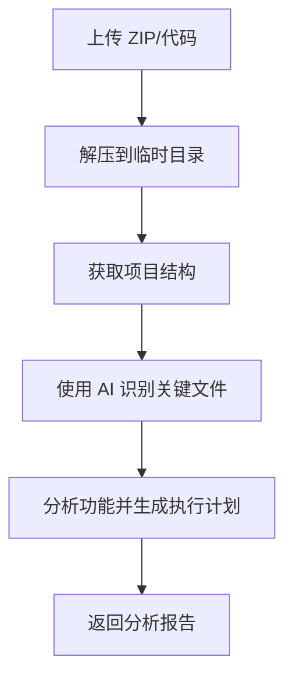
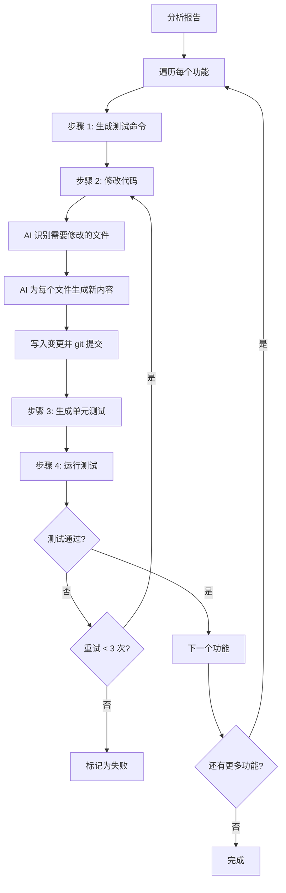

# Code Agent - AI 驱动的代码分析与测试工具

[English](README.md) | [简体中文](README.zh-CN.md)

一个由 Google Gemini AI 驱动的智能代码分析和测试代理。此工具可以分析代码库、实现功能、生成单元测试，并自动验证更改。

> **⚠️ 重要提示**  
> **本应用需要网络访问 Google Gemini API 才能正常运行**。请确保您的环境满足：
> - 有效的互联网连接
> - 可以访问 Google AI 服务 (api.google.com)
> - 已配置有效的 Gemini API 密钥
> - 防火墙未阻止 Google API 端点

## 🌟 功能特性

- **📊 智能代码分析**：分析项目结构并识别关键文件
- **🔧 自动化代码修改**：使用 AI 两步流程实现功能
- **🧪 智能测试生成**：基于代码变更自动生成单元测试
- **✅ 测试框架推荐**：为您的项目推荐最佳测试框架
- **🔄 自动化测试**：自动安装依赖并运行测试，生成报告
- **🐳 Docker 支持**：完全容器化，预配置开发环境
- **🌐 Web 界面**：用户友好的代码分析和测试工作流界面

## 📋 目录

- [架构](#架构)
- [逻辑流程](#逻辑流程)
- [前置要求](#前置要求)
- [本地部署](#本地部署)
- [Docker 部署](#docker-部署)
- [使用指南](#使用指南)
- [配置说明](#配置说明)
- [API 接口](#api-接口)

---

## 🏗️ 架构

### 系统组件

```
┌─────────────────────────────────────────────────────────────┐
│                     Web 界面 (HTML/JS)                       │
│                     http://localhost:8000                    │
└────────────────────────────┬────────────────────────────────┘
                             │
                             ▼
┌─────────────────────────────────────────────────────────────┐
│                    FastAPI 后端 (main.py)                    │
│  ┌──────────────────────────────────────────────────────┐   │
│  │  /api/analyze        - 分析代码库                    │   │
│  │  /api/run-and-test   - 运行实现工作流                │   │
│  │  /api/cleanup        - 清理临时文件                  │   │
│  └──────────────────────────────────────────────────────┘   │
└────────────────────────────┬────────────────────────────────┘
                             │
                             ▼
┌─────────────────────────────────────────────────────────────┐
│                    核心分析代理                              │
│                      (agent.py)                              │
│  ┌──────────────────────────────────────────────────────┐   │
│  │  • 项目结构分析                                      │   │
│  │  • 关键文件识别                                      │   │
│  │  • 功能位置映射                                      │   │
│  │  • 执行计划生成                                      │   │
│  └──────────────────────────────────────────────────────┘   │
└────────────────────────────┬────────────────────────────────┘
                             │
                             ▼
┌─────────────────────────────────────────────────────────────┐
│               LangGraph 工作流 (workflow.py)                 │
│                                                              │
│    步骤 1: 生成测试命令                                      │
│         ↓                                                    │
│    步骤 2: 修改代码（两步 AI 流程）                          │
│         ↓                                                    │
│    步骤 3: 生成单元测试                                      │
│         ↓                                                    │
│    步骤 4: 运行测试并验证                                    │
│         ↓                                                    │
│    ← 重试循环（测试失败时最多重试 3 次）                     │
│                                                              │
└────────────────────────────┬────────────────────────────────┘
                             │
                             ▼
┌─────────────────────────────────────────────────────────────┐
│                    AI 驱动工具集                             │
│                                                              │
│  ┌─────────────────────┐  ┌─────────────────────────────┐   │
│  │ generate_test_      │  │  code_modifier.py          │   │
│  │ commands.py         │  │  • 识别需要修改的文件      │   │
│  │ • 推荐测试框架      │  │  • 生成新内容              │   │
│  │ • 生成安装命令      │  │  • 写入磁盘                │   │
│  │ • 生成执行命令      │  │  • 创建备份                │   │
│  └─────────────────────┘  └─────────────────────────────┘   │
│                                                              │
│  ┌─────────────────────┐  ┌─────────────────────────────┐   │
│  │ generate_unittest.  │  │  run_unittest.py           │   │
│  │ py                  │  │  • 安装依赖                │   │
│  │ • 生成测试代码      │  │  • 按文件运行测试          │   │
│  │ • 框架感知          │  │  • 解析结果                │   │
│  │ • 保存到磁盘        │  │  • 汇总统计                │   │
│  └─────────────────────┘  └─────────────────────────────┘   │
└────────────────────────────┬────────────────────────────────┘
                             │
                             ▼
┌─────────────────────────────────────────────────────────────┐
│                  Gemini CLI 集成                             │
│                                                              │
│  • 模型：通过 GEMINI_MODEL 环境变量配置                     │
│  • 默认：gemini-2.5-flash                                   │
│  • 文件重定向避免截断                                        │
│  • 超时保护（120s - 1200s）                                 │
└─────────────────────────────────────────────────────────────┘
```

### 技术栈

| 组件 | 技术 |
|------|------|
| **后端** | FastAPI (Python 3.11+) |
| **AI 集成** | Google Gemini CLI |
| **工作流** | LangGraph |
| **前端** | HTML/JavaScript |
| **版本控制** | Git（用于变更跟踪） |
| **测试框架** | pytest, jest, vitest, mocha（自动检测） |
| **容器化** | Docker + Docker Compose |

---

## 🔄 逻辑流程

### 1. 代码分析流程



**步骤说明：**
1. **上传**：用户上传代码 ZIP 文件或提供目录
2. **解压**：代码解压到临时目录
3. **结构分析**：构建项目树结构
4. **关键文件识别**：AI 识别相关文件（API 路由、服务、模型）
5. **功能分析**：AI 定位功能实现位置
6. **执行计划**：AI 生成逐步实现指南

### 2. 实现与测试工作流



**详细步骤：**

#### 步骤 1: 生成测试命令
- **输入**：功能描述、代码库
- **处理**：
  - AI 分析项目并推荐测试框架
  - 生成依赖安装命令
  - 创建测试执行命令
- **输出**：框架推荐、安装和运行命令

#### 步骤 2: 修改代码（两步 AI 流程）
1. **识别阶段**：
   - AI 接收：需求 + 所有文件上下文
   - AI 返回：需要修改的文件列表
   
2. **生成阶段**（针对每个文件）：
   - AI 接收：需求 + 单个文件内容
   - AI 返回：完整的更新文件内容
   
3. **应用阶段**：
   - 写入变更并创建备份
   - Git 提交以跟踪变更
   - 生成 git diff

#### 步骤 3: 生成单元测试
- **输入**：功能描述、代码变更的 git diff、框架信息
- **处理**：
  - AI 从 git diff 分析变更
  - 为修改的功能生成全面的测试
  - 遵循框架特定的最佳实践
  - 将测试文件保存到磁盘
- **输出**：测试代码文件

#### 步骤 4: 运行测试
- **输入**：测试文件、安装命令
- **处理**：
  - 安装依赖（npm install、pip install 等）
  - 安装测试框架
  - 单独运行每个测试文件
  - 捕获并解析输出
- **输出**：测试结果、通过/失败状态

#### 重试机制
- **触发条件**：测试失败
- **最大重试次数**：每个功能 3 次
- **重试时**：
  - 错误上下文传回 AI
  - 尝试修复代码
  - 如需要生成新测试
  - 再次运行测试

### 3. Git 集成流程

```
初始状态
    ↓
git init
    ↓
git add . && git commit -m "初始状态"
    ↓
AI 修改代码
    ↓
git diff > changes.diff
    ↓
将 diff 传递给测试生成
    ↓
测试验证变更
```

**优势：**
- 通过 git diff 精确跟踪变更
- 需要时易于回滚
- 清晰的审计跟踪
- 基于实际变更生成测试

---

## 📦 前置要求

### 本地开发

- **Python**：3.11 或更高版本
- **Node.js**：20.x 或更高版本（用于 JS/TS 测试支持）
- **Gemini CLI**：Google 的 Gemini 命令行工具
- **Git**：用于工作流中的版本控制
- **Gemini API Key**：从 [Google AI Studio](https://makersuite.google.com/app/apikey) 获取

### Docker 部署

- **Docker**：20.10 或更高版本
- **Docker Compose**：1.29 或更高版本
- **Gemini API Key**：从 [Google AI Studio](https://makersuite.google.com/app/apikey) 获取

---

## 🚀 本地部署

### 1. 克隆仓库

```bash
git clone <your-repo-url>
cd code-agent
```

### 2. 安装 Python 依赖

```bash
# 创建虚拟环境（推荐）
python -m venv venv
source venv/bin/activate  # Windows: venv\Scripts\activate

# 安装依赖
pip install -r requirements.txt
```

### 3. 安装 Gemini CLI

```bash
# 全局安装
npm install -g @google/gemini-cli

# 验证安装
gemini --version
```

### 4. 安装 Node.js（用于 JS/TS 测试支持）

```bash
# macOS（使用 Homebrew）
brew install node@20

# Ubuntu/Debian
curl -fsSL https://deb.nodesource.com/setup_20.x | sudo -E bash -
sudo apt-get install -y nodejs

# Windows
# 从 https://nodejs.org/ 下载
```

### 5. 配置环境变量

```bash
# 复制示例环境文件
cp env.example .env

# 编辑 .env 并添加配置
nano .env
```

**.env 文件：**
```bash
# 必需
GEMINI_API_KEY=your_gemini_api_key_here

# 可选（有默认值）
GEMINI_MODEL=gemini-2.5-flash
HOST=0.0.0.0
PORT=8000
LOG_LEVEL=INFO
```

### 6. 运行应用

```bash
# 启动服务器
uvicorn main:app --host 0.0.0.0 --port 8000 --reload

# 或使用 Python 直接运行
python -c "import uvicorn; uvicorn.run('main:app', host='0.0.0.0', port=8000, reload=True)"
```

### 7. 访问应用

在浏览器中打开：
```
http://localhost:8000
```

---

## 🐳 Docker 部署

> **📡 网络要求**：确保您的 Docker 容器具有互联网访问权限以访问 Google Gemini API 端点。

### 快速开始

```bash
# 1. 创建 .env 文件
cp env.example .env

# 2. 添加 Gemini API key 到 .env
echo "GEMINI_API_KEY=your_key_here" >> .env

# 3. 构建并运行
docker-compose up -d

# 4. 查看日志
docker-compose logs -f

# 5. 访问应用
# http://localhost:8000
```

### 详细 Docker 命令

#### 构建镜像

```bash
docker build -t code-agent:latest .
```

#### 使用 Docker Compose 运行

```bash
# 后台启动
docker-compose up -d

# 带日志启动
docker-compose up

# 停止
docker-compose down

# 重新构建并启动
docker-compose up -d --build
```

#### 使用 Docker CLI 运行

```bash
docker run -d \
  --name code-agent \
  -p 8000:8000 \
  -e GEMINI_API_KEY=your_api_key \
  -e GEMINI_MODEL=gemini-2.5-flash \
  -v $(pwd)/temp:/app/temp \
  code-agent:latest
```

#### 常用 Docker 命令

```bash
# 查看日志
docker logs -f code-agent

# 在容器内执行命令
docker exec -it code-agent bash

# 测试 gemini-cli
docker exec code-agent gemini --version

# 检查环境变量
docker exec code-agent env | grep GEMINI
```

### Docker 环境变量

在 `docker-compose.yml` 或 `.env` 中配置：

```yaml
environment:
  - GEMINI_API_KEY=${GEMINI_API_KEY}
  - GEMINI_MODEL=${GEMINI_MODEL:-gemini-2.5-flash}
  - PYTHONUNBUFFERED=1
```

---

## 💻 使用指南

### Web 界面

1. **访问** `http://localhost:8000`
2. **上传** 代码 ZIP 文件
3. **输入** 功能描述
4. **点击"分析代码"** 来分析代码库
5. **查看** 分析报告
6. **点击"运行实现"** 执行工作流
7. **监控** 进度和测试结果

### API 使用

#### 1. 分析代码

```bash
curl -X POST http://localhost:8000/api/analyze \
  -F "file=@your-code.zip" \
  -F "problem_description=实现用户认证功能"
```

**响应：**
```json
{
  "project_structure": "...",
  "feature_analysis": [...],
  "execution_plan_suggestion": "...",
  "codebase_path": "/app/temp/tmp_xxxxx"
}
```

#### 2. 运行实现与测试

```bash
curl -X POST http://localhost:8000/api/run-and-test \
  -H "Content-Type: application/json" \
  -d '{
    "analysis_report": {...},
    "base_directory": "/app/temp/tmp_xxxxx"
  }'
```

#### 3. 清理临时文件

```bash
curl -X POST http://localhost:8000/api/cleanup \
  -H "Content-Type: application/json" \
  -d '{"path": "/app/temp/tmp_xxxxx"}'
```

---

## ⚙️ 配置说明

### 环境变量

| 变量名 | 说明 | 必需 | 默认值 |
|--------|------|------|--------|
| `GEMINI_API_KEY` | Gemini API 密钥 | ✅ 是 | - |
| `GEMINI_MODEL` | 使用的 Gemini 模型 | 否 | `gemini-2.5-flash` |
| `HOST` | 服务器主机 | 否 | `0.0.0.0` |
| `PORT` | 服务器端口 | 否 | `8000` |
| `LOG_LEVEL` | 日志级别 | 否 | `INFO` |

### 可用的 Gemini 模型

- `gemini-2.5-flash` - 快速、经济高效（推荐）
- `gemini-1.5-pro` - 更强大、较慢
- `gemini-1.5-flash` - 平衡性能

### 切换模型

```bash
# 在 .env 文件中
GEMINI_MODEL=gemini-1.5-pro

# 或作为环境变量
export GEMINI_MODEL=gemini-1.5-pro
uvicorn main:app
```

---

## 🔌 API 接口

### POST `/api/analyze`

分析代码库并识别功能位置。

**请求：**
- `file`：ZIP 文件（multipart/form-data）
- `problem_description`：功能需求（文本）

**响应：**
```json
{
  "project_structure": "string",
  "feature_analysis": [
    {
      "feature_description": "string",
      "implementation_location": [...]
    }
  ],
  "execution_plan_suggestion": "string",
  "codebase_path": "string"
}
```

### POST `/api/run-and-test`

执行实现工作流并测试。

**请求：**
```json
{
  "analysis_report": {...},
  "base_directory": "/path/to/code"
}
```

**响应：**
```json
{
  "results": [
    {
      "feature": "...",
      "success": true,
      "test_results": {...}
    }
  ]
}
```

### POST `/api/cleanup`

清理临时目录。

**请求：**
```json
{
  "path": "/path/to/temp/dir"
}
```

### GET `/health`

健康检查接口。

**响应：**
```json
{
  "status": "healthy"
}
```

---

## 🧪 测试支持

### 支持的框架

- **Python**：pytest、unittest
- **JavaScript/TypeScript**：jest、vitest、mocha
- **Java**：junit
- **Go**：go test
- **PHP**：phpunit
- **Ruby**：rspec

### 自动检测

系统自动：
1. 为您的项目推荐最佳框架
2. 安装所需依赖
3. 生成框架特定的测试
4. 使用适当的命令运行测试

---

## 🛠️ 故障排除

### 常见问题

**1. 找不到 Gemini CLI**
```bash
# 全局安装
npm install -g @google/gemini-cli

# 验证
which gemini
```

**2. API Key 未设置**
```bash
# 检查 .env 文件
cat .env | grep GEMINI_API_KEY

# 手动设置
export GEMINI_API_KEY=your_key
```

**3. 端口已被占用**
```bash
# 检查端口 8000 的使用情况
lsof -i :8000

# 使用不同端口
PORT=8001 uvicorn main:app
```

**4. Docker 容器无法启动**
```bash
# 查看日志
docker-compose logs code-agent

# 重新构建
docker-compose down
docker-compose up --build
```

**5. 网络/API 连接问题**
```bash
# 从容器测试网络连接
docker exec code-agent ping -c 3 google.com

# 测试 Gemini CLI
docker exec code-agent gemini -p "test" --output-format json

# 检查 API key 是否设置
docker exec code-agent env | grep GEMINI_API_KEY

# 验证防火墙是否允许出站 HTTPS
curl -I https://generativelanguage.googleapis.com
```

---

## 📝 示例工作流

```bash
# 1. 启动应用
docker-compose up -d

# 2. 通过 Web 界面上传代码
# 访问 http://localhost:8000

# 3. 输入功能描述：
# "添加 JWT 令牌的用户认证"

# 4. 点击"分析代码"
# 系统分析并识别相关文件

# 5. 点击"运行实现"
# 观察系统：
#   - 推荐测试框架
#   - 修改代码文件
#   - 生成单元测试
#   - 运行测试
#   - 报告结果

# 6. 查看结果
# 查看修改的文件、生成的测试和结果
```

---

## 📚 其他文档

- [Docker 部署指南](DOCKER.md)
- [架构深入解析](docs/architecture.md) *（如果存在）*
- [API 参考](docs/api.md) *（如果存在）*

---

## 🤝 贡献

1. Fork 仓库
2. 创建功能分支
3. 进行修改
4. 运行测试
5. 提交 Pull Request

---

## 📄 许可证

[您的许可证]

---

## 🙏 致谢

- **Google Gemini**：支持分析的 AI 模型
- **FastAPI**：Web 框架
- **LangGraph**：工作流编排
- **Docker**：容器化

---

## 📞 支持

遇到问题或有疑问：
- 在 GitHub 上提交 Issue
- 查看[故障排除部分](#故障排除)
- 参考 [Docker 指南](DOCKER.md)

---

**使用 Google Gemini AI 精心打造 ❤️**

